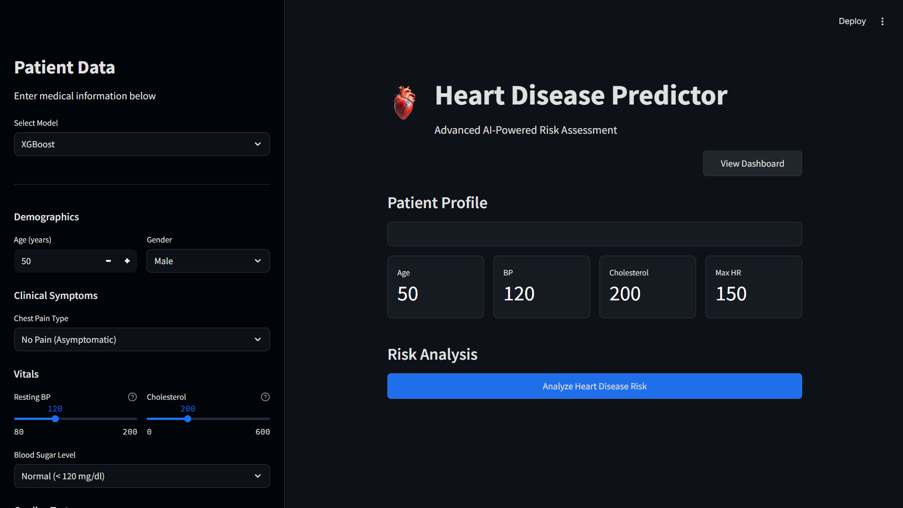

# Heart Disease Prediction & Failure Analysis

<div align="left">
<p align="left">
  
  
  
  
  
  
  
  
</p>
</div>

## Project Overview
Heart failure is a high-risk condition where delayed detection can lead to severe outcomes. This project builds an end-to-end machine learning system for early risk prediction using routinely available clinical data.

The system generates patient-level risk predictions and pairs them with SHAP-based explanations to ensure transparency. In parallel, a Power BI dashboard analyzes survival trends across demographic and clinical variables, enabling population-level insights alongside individual predictions. The focus is on interpretability, failure awareness, and real-world usability not accuracy in isolation.

## Problem Statement
- **Late Risk Detection**: Heart failure often progresses without obvious symptoms. This project targets early risk identification using routinely collected clinical features.
- **Lack of Model Trust**: Many clinical ML systems act as black boxes. This system integrates SHAP-based explanations to show feature-level contributions behind each prediction.
- **Complex Feature Interactions**: Traditional clinical risk scores rely on linear assumptions and fixed thresholds. This project leverages tree-based ensemble models to capture non-linear interactions among clinical features.
- **Isolated Decision-Making**: Individual predictions lack population context. The Power BI dashboard enables analysis of survival trends and risk factors across demographic and clinical groups.

## Datasets

### Prediction Dataset
- **Source**: Integrated Heart Disease Dataset  
- **Records**: 918 patient records  
- **Purpose**: Model training  
- **Target**: Presence of heart disease (0/1)

### Failure Analysis Dataset
- **Source**: Heart Failure Clinical Records Dataset  
- **Records**: 299 patient records  
- **Purpose**: Mortality and survival analysis (Power BI)  
- **Target**: `DEATH_EVENT`

## Machine Learning Pipeline
A structured ML workflow used during model development:
- Data validation and basic outlier handling
- Preprocessing using sklearn pipelines
- Train–test split for evaluation
- Ensemble model training (Random Forest, XGBoost)
- Evaluation using classification metrics
- Explainability using SHAP
- Model artifacts saved for Streamlit deployment

## Model Performance
Model performance on the test set:

| Metric | Random Forest | XGBoost |
|------|---------------|---------|
| Accuracy | 88.04% | 88.59% |
| ROC-AUC | 0.92 | 0.93 |
| Precision | 0.89 | 0.90 |
| Recall | 0.90 | 0.89 |
| F1-Score | 0.89 | 0.90 |

XGBoost shows marginally better overall performance and is preferred for deployment.

## Explainability & Failure Analysis
To reduce black-box behavior and support clinical trust:
- **Global Interpretability**: SHAP summary plots highlight key drivers such as `ST_Slope`, `ChestPainType`, and `Oldpeak`.
- **Local Interpretability**: Waterfall plots explain why a specific patient received a high-risk prediction.
- **Failure Analysis**: Identification of patient subgroups where the model underperforms, informing future data collection and model improvements.

## Analytical Dashboard (Power BI)
Population-level analysis of mortality trends and clinical risk factors.


## Results & Key Insights
- Ensemble models achieve strong discrimination using routine clinical features (ROC-AUC ≈ 0.93).
- Explainability analysis highlights ECG-related and exercise-induced indicators as key risk drivers.
- Failure analysis emphasizes the importance of contextual interpretation for specific patient subgroups.

## Limitations & Future Work
- Limited dataset size and retrospective data restrict generalization.
- No temporal modeling of disease progression.
- Future work includes survival modeling, larger datasets, and model monitoring.

## App Demo
<a href="https://heart-disease-prediction-failure-analysis.streamlit.app/" target="_blank">
  
</a>



## How to Run
```bash
pip install -r requirements.txt
streamlit run app.py
